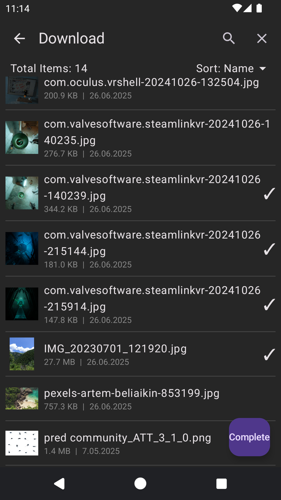
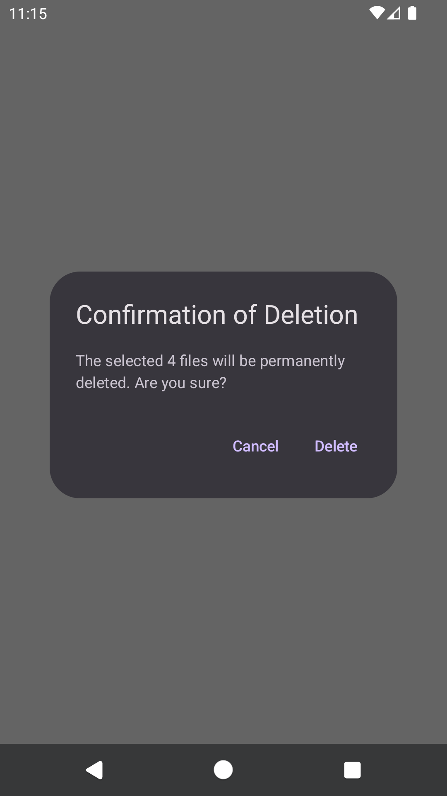
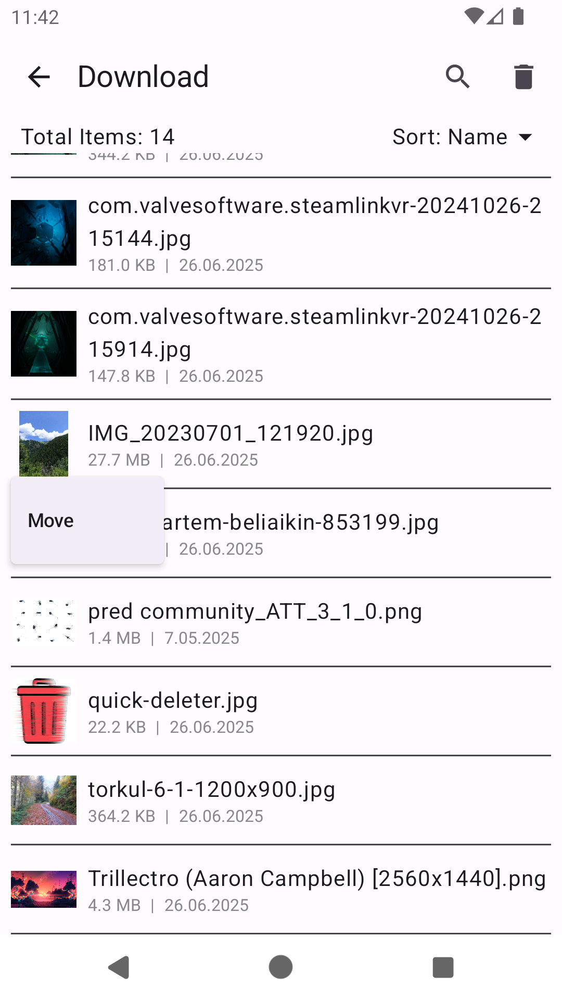
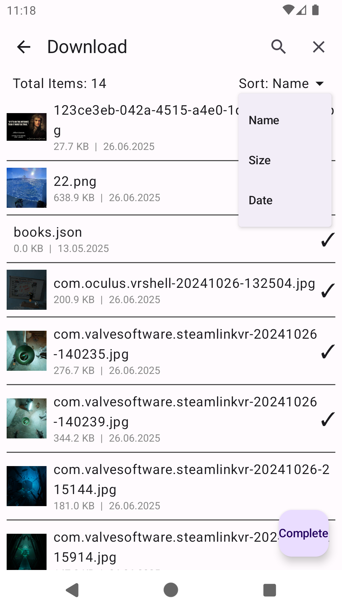

# 📁 QuickDeleter

**QuickDeleter** is a mobile application developed for quickly browsing, selecting, and deleting files and folders on Android devices. With its user-friendly interface, users can navigate directories, preview images, view file details, and easily remove unnecessary content.

---

## 🚀 Features

- 📂 Navigate through folder structure  
- 🖼️ Image preview support for JPG, PNG, and JPEG files  
- 🗑️ Deletion mode: select multiple files and delete in one action  
- 🔍 Search functionality: filter files by name  
- ↕️ Sorting options: by Name, Size, or Date (ascending/descending)  
- 📄 File size and last modified date display  
- 🧭 Displays item count inside folders  
- ➖ Clean interface with divider lines between items  
- 📦 **Move Files and Folders**  
  Ability to move selected files to a different directory via a "Move" button that appears on long press  
- 🔄 **State-Aware Deletion**  
  Only files in the currently visible directory are deleted during deletion action  
- ✅ **Preserved State After Move**  
  Deletion mode, and selected files are preserved and updated correctly after moving a file

---

## 📸 Screenshots

<table>
  <tr>
    <td align="center">
      🗑️ <strong>Deletion Mode</strong><br/>
      <br/>
    </td>
    <td align="center">
      ✅ <strong>Delete Confirmation</strong><br/>
      <br/>
    </td>
  </tr>
  <tr>
    <td align="center">
      📂 <strong>Move Files</strong><br/>
      <br/>
    </td>
    <td align="center">
      ↕️ <strong>Sort Files</strong><br/>
      <br/>
    </td>
  </tr>
</table>

---

## 🚧 Feature Work

The following improvements and features are planned for future versions of QuickDeleter:

- 🗂️ **Create New Folders**  
  Option to create a new directory while selecting a destination to move files.

- 🔄 **Advanced State Persistence**  
  Current folder path and UI state will be preserved across configuration changes and deep navigation.

- 📌 **Scroll Position Retention**  
  When returning from navigation (after moving a file), the previous scroll position will be restored.

- ✏️ **Rename Files and Folders**  
  Ability to rename files or folders with a simple dialog interface.

- 🧹 **Hide Empty Folders**  
  Option to filter out and hide folders that contain no files or subfolders.

- 🌙 **Dark Mode Optimization**  
  Improved visual appearance and readability in dark theme.

- 🧱 **Class Modularity & Code Structure Enhancement**  
  Refactor the codebase into reusable and well-structured classes and components to improve maintainability and scalability.

---

*More enhancements and UI refinements are on the roadmap as the project evolves.*

## ⚙️ Installation

> To open and run the project in Android Studio:

```bash
git clone https://github.com/EnesTopal/quick-deleter.git
``` 

---

© 2025 Enes Topal. MIT License.
